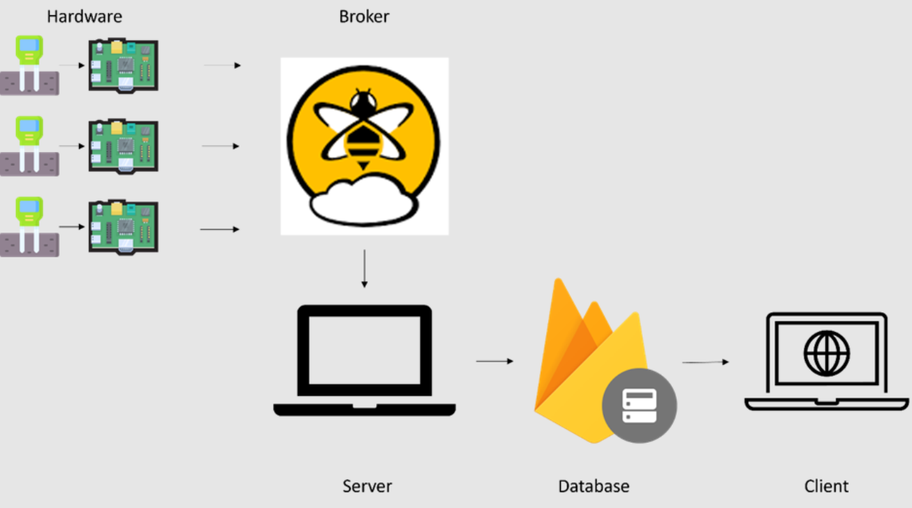

# IoT Smart Plant Monitoring System

## Introduction

This project introduces an IoT smart plant monitoring system designed to provide real-time soil moisture data for efficient plant care. Utilizing Raspberry Pi and MQTT technology, this system allows plant owners to accurately monitor and optimize watering schedules, ensuring healthier plant growth.

## Design Overview

### High-Level Architecture

Our system leverages the Raspberry Pi as a Single Board Computer (SBC) to interface with soil moisture sensors. It utilizes MQTT for message publishing to a server via an MQTT broker, hosted on HiveMQ. This cloud-based approach allows remote implementation of the server and seamless data flow.

The system architecture supports scalability, allowing easy integration of additional sensor modules for diverse plant species. It ensures robustness by decoupling the sensor ecosystem from the database through a server gateway.

### Database Schema

Our database schema is structured as follows:

- `plants`
  - `plant_id`
    - `species`: "Plant species"
    - `location`: "Plant location"
    - `moisture_levels`
      - `timestamp`: moisture_value
      - ...

## Implementation

### Hardware Components

- **Soil Moisture Sensors:** We use capacitive soil moisture sensors, which offer durability and corrosion resistance.
- **Single Board Computer:** A Raspberry Pi is used for data collection and communication with the Firebase Realtime Database.
- **ADC:** An ADC module interfaces with the Raspberry Pi Zero to process analog input from the sensor.

### Software Components

- **Firmware for SBC:** Responsible for sensor interfacing, data collection, and MQTT communication.
- **Server:** Handles read/write operations to the Firebase database and ensures reliable message reception and processing.
- **User Interface (Web Client):** A web-based interface for visualizing plant data.

---

This system is a step towards integrating technology with environmental care, making plant maintenance more efficient and data-driven.
